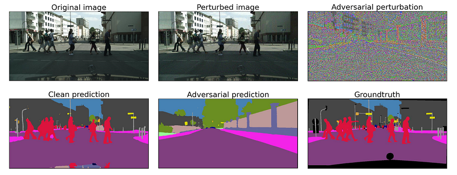
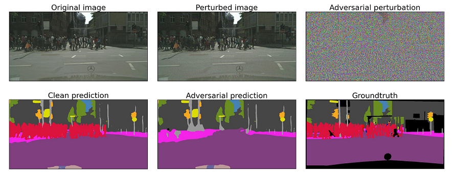

# Attack tool

## About
An adversarial attack toolbox to assess semantic segmentation neural networks under diverse attacks. Initially implemented in **PyTorch**.

## Structure 
This attack tool is structured in the following way:
* The folder [attacks](https://github.com/ifnspaml/TUBSRobustCheck/tree/main/robustness/attacks/) contains the [base class](https://github.com/ifnspaml/TUBSRobustCheck/tree/main/robustness/attacks/base.py) that is used for the implementation of all attacks as well as all attacks of this tool.
* An working example can be found in the [examples](https://github.com/ifnspaml/TUBSRobustCheck/tree/main/robustness/examples/) folder. 
Please refer to the file [create_adv_examples.py](https://github.com/ifnspaml/TUBSRobustCheck/tree/main/robustness/examples/) if you have doubts on how to load and attack a semantic segmentation neural network using our attack tool.

## Support
Currently, the following attacks are implemented:
- Fast Gradient Sign Method (FGSM) [1](https://arxiv.org/abs/1412.6572)
- Iterative Fast Gradient Sign Method (I-FGSM) [1](https://arxiv.org/abs/1607.02533)
- Momentum Iterative Fast Gradient Sign Method (MI-FGSM) [1](https://arxiv.org/abs/1710.06081)
- Generalizable Data-free Universal Adversarial Perturbations (GD-UAP) [1](https://arxiv.org/abs/1801.08092)
- Metzen single image attack (dynamic/static) [1](https://arxiv.org/abs/1703.01101)
- Metzen universal attack (dynamic/static) [1](https://arxiv.org/abs/1704.05712)

For more information, e.g., on the implemented Lp-norm for each attack, please refer to the attack implementation.

Please note that our attack tool can be easily extended to accommodate other attacks. In addition, the use of [IFN Dataloader](https://github.com/ifnspaml/IFN_Dataloader) is not mandatory but rather a recommendation to avoid compatibility problems.

Also note that our attacks do **NOT** consider that the network is trained on a background/ignore class.

## Examples

The following examples were produced using a SwiftNet[1](https://www.sciencedirect.com/science/article/abs/pii/S0031320320304143),[2](In Defense of Pre-trained ImageNet Architectures for Real-time Semantic Segmentation of Road-driving Images) trained on the [Cityscapes](https://www.cityscapes-dataset.com/) dataset. 

#### Metzen static single image attack
The attack tool receives as inputs the **original image**, a (static) **target semantic segmentation** as well as a (trained) deep neural network.
Internally, it computes an **adversarial perturbation** and adds it to the original image resulting in an adversarial example.
The adversarial example (or rather the adversarial perturbation) to fool the neural network into always predicting the same **static image**.
The results in the second row show that the **adversarial example** could substantially fool the neural network to
predict an image that closely resembles the static image, instead of the **clean prediction** which it was supposed to. 
The image to the bottom right shows the **groundtruth** for the clean image.
 
  

#### Example of a Metzen dynamic single image attack:

The attack tool receives as input the **original image** and computes and adds an **adversarial perturbation** targetted to fool the neural network to classify the pixels corresponding to **pedestrians** to the nearest neighbor classes.
The results in the second row show that the **adversarial example** could substantially fool the neural network into
predicting an image without pedestrians, instead of the **clean prediction** with pedestrians. 
The image to the bottom right shows the **groundtruth** for the clean image.

  

Similarly, we could also compute (static/dynamic) Metzen attacks using an universal (dataset-based) approach. For that, 
we would optimize the adversarial perturbation over a dataset instead of a single image.