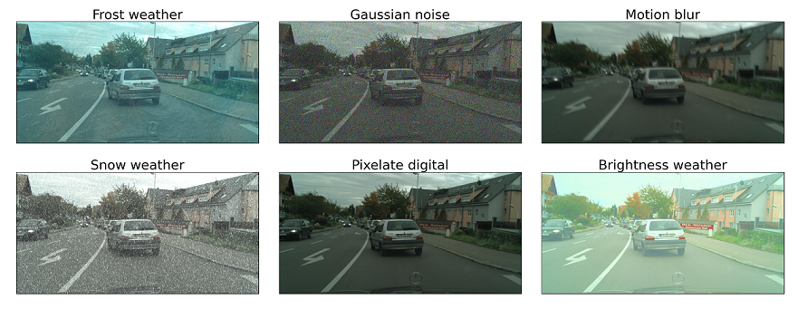

# Corruption tool

## About
A corruption toolbox to assess semantic segmentation neural networks under various corruptions. Initially implemented in **PyTorch**.

## Structure 
In this corruption tool, we follow Hendrycks et al. (see [(Hendrycks et al., ICLR 2019)](https://arxiv.org/pdf/1903.12261.pdf) or [github](https://github.com/hendrycks/robustness)) as well as Kamann et al. (see [(Kamann et al., IJCV article)](https://link.springer.com/content/pdf/10.1007/s11263-020-01383-2.pdf) or [(Kamann et al., CVPR 2020)](https://openaccess.thecvf.com/content_CVPR_2020/papers/Kamann_Benchmarking_the_Robustness_of_Semantic_Segmentation_Models_CVPR_2020_paper.pdf)), who applied the corruptions from Hendrycks et al. and some additional ones to the task of semantic segmentation ([Cityscapes](https://www.cityscapes-dataset.com/), [Pascal VOC 2012](http://host.robots.ox.ac.uk/pascal/VOC/voc2012/), [ADE20k](http://sceneparsing.csail.mit.edu/)).

This corruption tool is structured in the following way:
* The folder [corruptions](https://datahost.ifn.ing.tu-bs.de/gitlab/computer-vision/attack_tool/-/tree/master/robustness/corruptions) contains the [base class](https://datahost.ifn.ing.tu-bs.de/gitlab/computer-vision/attack_tool/-/blob/master/robustness/corruptions/base.py) that is used as a parent class for all corruptions.
* An example of how to use the corruption tool can be found in the [examples](https://datahost.ifn.ing.tu-bs.de/gitlab/computer-vision/attack_tool/-/tree/master/robustness/examples) folder. Please refer here to the file [create_corruptions.py](https://datahost.ifn.ing.tu-bs.de/gitlab/computer-vision/attack_tool/-/blob/master/robustness/examples/create_corruptions.py).

## Support
Currently, the following corruptions are implemented:
- **Noise:** Gaussian, Shot, Impulse, Speckle
- **Blur:** Defocus, Glass, Motion, Zoom, Gaussian
- **Weather:** Snow, Frost, Fog, Brightness, Spatter
- **Digital:** Contrast, Elastic transform, Pixelate, JPEG compression, Saturate

Please note that our corruption tool can be easily extended to accommodate other corruptions. In addition, the use of [IFN Dataloader](https://github.com/ifnspaml/IFN_Dataloader) is not mandatory but rather a recommendation to avoid compatibility problems.

## Examples
The following examples were produced using the [Cityscapes](https://www.cityscapes-dataset.com/) dataset:

  

## Comparison with Hendrycks' code base
During the implementation of the Hendrycks corruptions' code base in our corruption tool, we changed some parts of the code.
In order to assess whether our code comply with the results of the original implementation, we prepared some tests.
Please take a closer look on our [benchmark](https://datahost.ifn.ing.tu-bs.de/gitlab/computer-vision/attack_tool/-/blob/Metzen_merge/robustness/corruptions/bench_test/benchmark_test.py) code.
Note that, our robustness tool as well as [imagenet_c](https://github.com/hendrycks/robustness/tree/master/ImageNet-C/imagenet_c) needs to be installed.

This code lead to np.allclose() returning **True**, which means that our results are very close to the results achived by the code base of Hendrycks.
For some corruptions we had to switch precision to torch.float64 as numpy works natively with float64 leading to different results after performing the operations multiplying by 255 and casting to uint8.